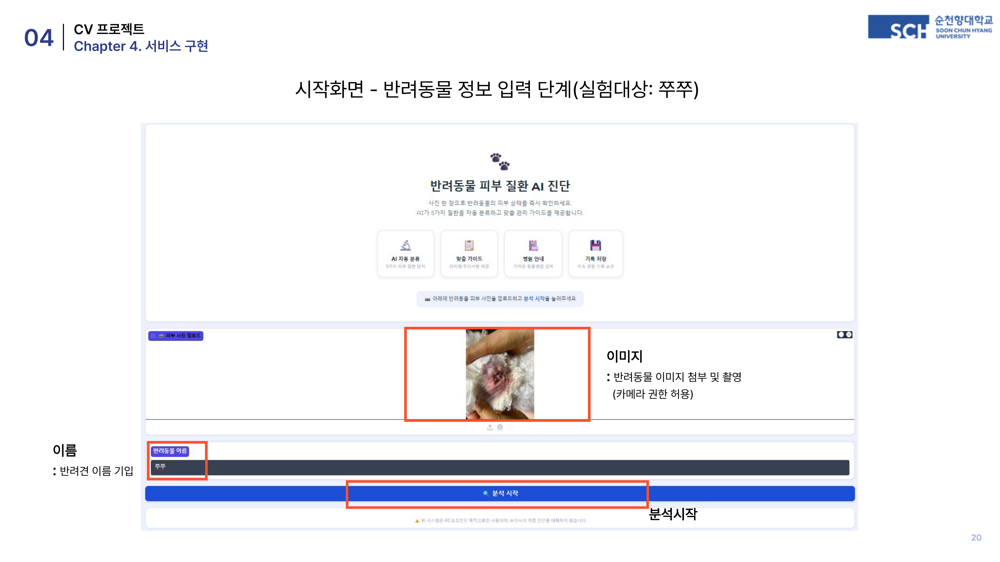
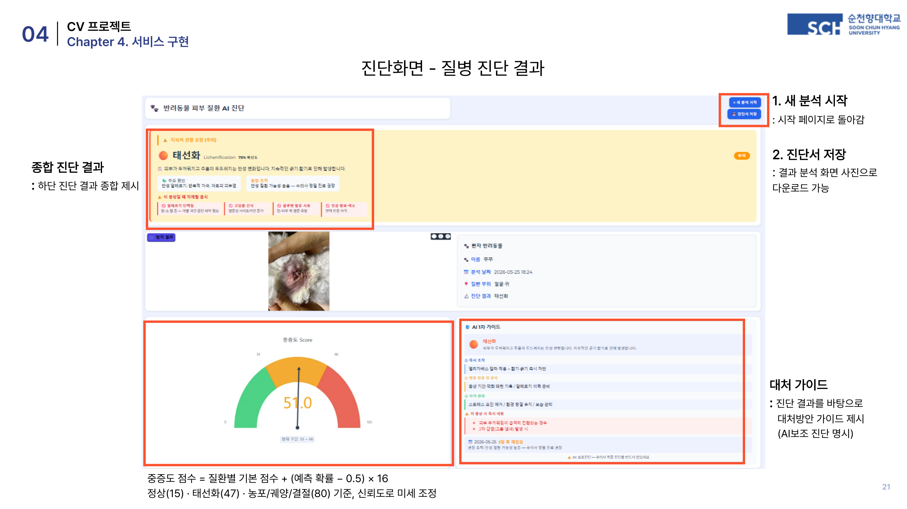
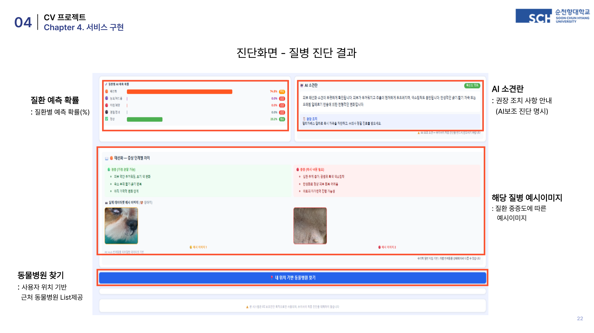
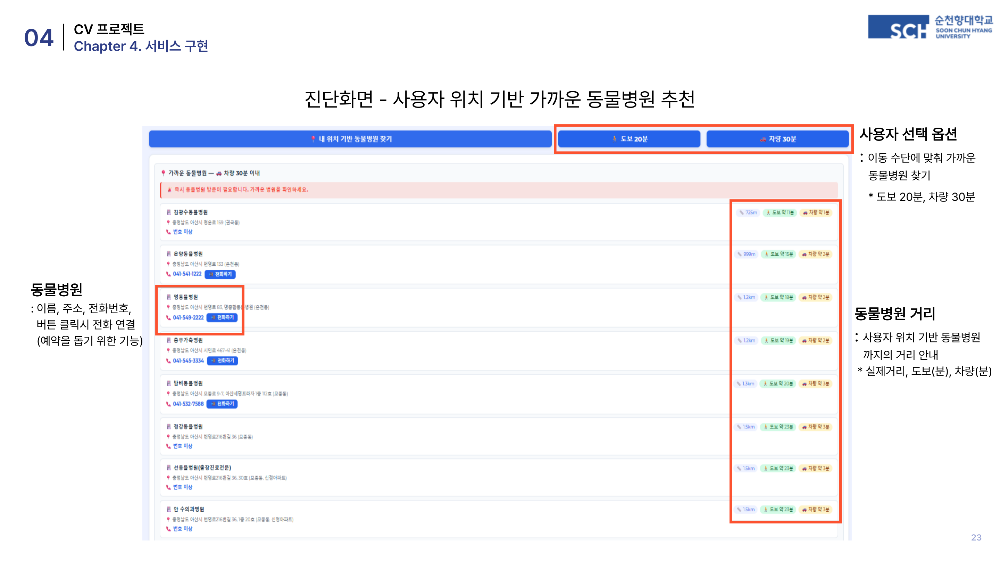
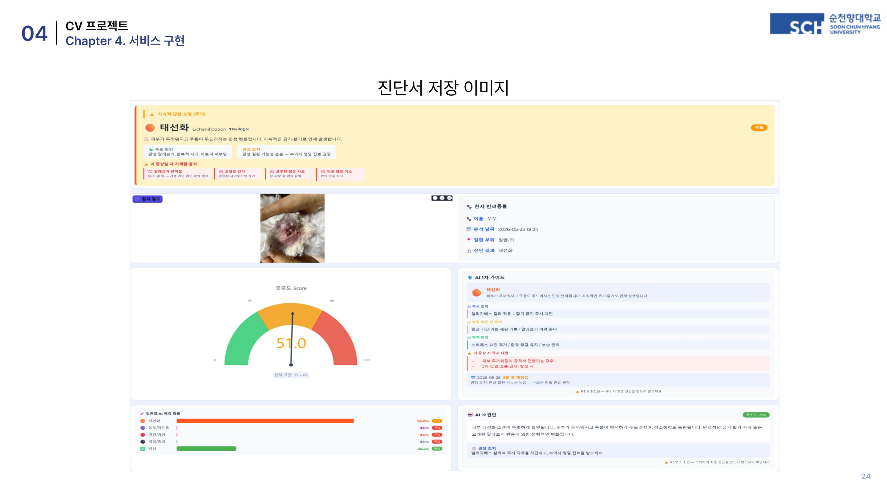

# 🐾 반려동물 피부 질환 AI 자가진단 시스템

> 펫휴머니제이션 시대, 스마트폰 카메라 한 장으로 반려동물의 피부 상태를 즉시 확인하세요.

순천향대학교 AI·빅데이터학과 컴퓨터 비전 프로젝트  
**이학주 (20211459) · 이민재 (20211462)**

---

## 소개

이 프로젝트는 반려동물 보호자가 동물병원 방문 전, 집에서 피부 사진 한 장으로 질환 여부와 중증도를 확인할 수 있는 **AI 1차 스크리닝 도구**입니다.

동물 의료비는 건강보험이 적용되지 않는 100% 비급여입니다. 늦은 발견으로 복합 치료에 들어가면 보호자 부담이 크게 늘어납니다. 본 시스템은 '진료 대체'가 아닌 **'조기 진단 보조'** 를 목표로, YOLO26m → SAM2 → SigLIP2 SO400M의 3단계 파이프라인으로 피부 병변을 탐지·분류합니다.

---

## 화면 미리보기

**시작 화면 — 반려동물 피부 사진 업로드**



**진단 결과 — 질환명 · 중증도 Score · AI 케어 가이드**



**질환 예측 확률 & 증상 단계별 비교**



**위치 기반 가까운 동물병원 추천**



**진단서 저장 — 수의사 상담 시 활용**



---

## 주요 기능

- **AI 자동 진단** — 사진 1장으로 5가지 피부 질환 자동 분류
- **중증도 Score 산출** — 0~100점 기반 위험도 표시 (Low / Medium / High)
- **맞춤 케어 가이드** — 질환별 즉시 조치·자가 관리·재방문 기준 안내
- **진단서 저장** — 결과 화면을 이미지로 저장하여 수의사 상담 시 활용
- **위치 기반 동물병원 추천** — 도보 20분 / 차량 30분 내 가까운 병원 리스트 제공

---

## 탐지 질환 (5종)

| 질환 | 설명 |
|------|------|
| 태선화 (Lichenification) | 만성 알레르기·반복 자극으로 피부가 두꺼워지는 변화 |
| 농포/여드름 (Pustule/Acne) | 세균 감염에 의한 고름이 찬 작은 종기 |
| 미란/궤양 (Erosion/Ulcer) | 피부 표면이 손상되어 헐거나 파인 상태 |
| 결절/종괴 (Nodule/Mass) | 피부 아래 혹 또는 덩어리가 생긴 상태 |
| 정상 (Normal) | 이상 소견 없음 |

---

## 모델 파이프라인

```
입력 이미지
    │
    ▼
[1단계] YOLO26m  ─── 병변 위치 탐지 + 관심영역 추출
    │                SAM2에 박스 프롬프트 전달
    ▼
[2단계] SAM2.1  ──── 정밀 픽셀 세그멘테이션
    │                털·조명·불규칙 경계 보정
    ▼
[3단계] SigLIP2 SO400M  ── 질환 분류 + 위험도 산출
                           테스트 정확도 85.97%
```

**데이터셋**: AI Hub 반려동물 피부 질환 데이터 (총 43,713장, 5클래스 stratified 70/15/15 split)

---

## 성능 지표

| 모델 | 지표 | 값 |
|------|------|----|
| YOLO26m | mAP50 | 7.82% |
| YOLO26m | Precision | 18.3% |
| YOLO26m | Recall | 12.2% |
| SigLIP2 SO400M (v2) | Test Accuracy | **85.97%** |
| SigLIP2 SO400M (v2) | Val Accuracy | 83.66% |

**클래스별 정확도**: 결절/종괴 92.5% · 미란/궤양 87.6% · 농포/여드름 86.3% · 태선화 84.7% · 정상 79.5%

---

## 파일 구조

```
├── README.md
├── requirements.txt
├── 06_app.py               # 메인 Gradio 웹 앱
├── 07_yolo26_det.py        # YOLO26m 병변 탐지 모듈
├── 09_siglip2_6class.py    # SigLIP2 6클래스 분류 모델
├── 10_siglip2_v2.py        # SigLIP2 v2 최종 분류 모델
├── hospital_finder.py      # 위치 기반 동물병원 탐색
├── 01b_rebuild_index.py    # 데이터 인덱스 재빌드
├── 02_eda.py               # 탐색적 데이터 분석 (EDA)
├── 03_prepare_yolo.py      # YOLO 학습용 데이터 전처리
└── screenshots/            # 앱 화면 스크린샷
```

---

## 사용 방법

### 환경 설치

```bash
pip install -r requirements.txt
```

### 앱 실행

```bash
python 06_app.py
```

실행 후 브라우저에서 접속하여 반려동물 피부 사진을 업로드하면 자동으로 진단이 시작됩니다.

### 필요 모델 가중치 (별도 다운로드)

| 파일 | 설명 |
|------|------|
| `yolo26m_det_v2/weights/best.pt` | YOLO26m 학습 가중치 |
| `siglip2_6class.pt` | SigLIP2 파인튜닝 가중치 |
| `sam2.1_hiera_tiny.pt` | SAM2.1 세그멘테이션 가중치 |

---

## 기술 스택

- **언어**: Python 3.10+
- **딥러닝**: PyTorch, HuggingFace Transformers
- **모델**: YOLO26m, SAM2.1, SigLIP2-SO400M
- **웹 UI**: Gradio
- **데이터**: AI Hub 반려동물 피부 질환 데이터셋

---

## 한계 및 향후 계획

- 정상 클래스 분류 정확도 79.5%로 타 클래스 대비 낮음 → Hard Negative Mining 적용 예정
- 반려묘 전용 파인튜닝 모델 분리 구축
- 추가 질환 카테고리 확장 (인설·가피, 슬개골, 백내장)
- 촬영 조건 민감도 개선 (조명·각도·해상도)

---

## 주의사항

> ⚠️ 본 시스템은 AI 보조 진단 도구입니다. 수의사의 최종 진단을 대체하지 않습니다.  
> 진단 결과와 관계없이 증상이 지속되거나 악화되면 반드시 동물병원을 방문하세요.

---

## 라이선스

MIT License

---

*순천향대학교 AI·빅데이터학과 컴퓨터 비전 수업 프로젝트 (2026)*
